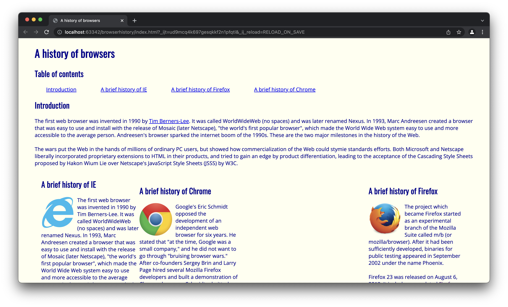

With my initial experiences in Computer Science, and coding in general, my exposure to software development has been standalone programs or what would be backend development. The take at frontend web development has certainly been unlike any coding assignments I have taken on. While difficulty presents itself from a different perspective, the development process has a similar feel to other Computer Science related tasks. As our approach is to learn the “Why’s” of design, starting with raw HTML/CSS without the assistance of frameworks can be difficult to navigate. After taking on this task, I found that my site quality rivaled that of the early 2000s. An infuriating process of divs holding divs, classes to change seemingly meaningless settings. With such limited experience in this field, what seems as a quick action (centering objects, setting page backgrounds to resize with windows, navigation bars, etc) can turn into hour long endeavors in order to produce an aesthetically pleasing look. My attempt at the initial BrowserHistory WOD was successful though it was cluttered in design.

<h3>Our Savior</h3>

Thankfully, at the close of our initial module on UI design basics, we were finally introduced to the world of CSS frameworks, specifically Semantic UI. Explaining the level of ease this simple change has given to peers has been quite difficult. With the utilization of Semantic UI, appealing website design can be achieved in a fraction of the time it would take to accomplish with pure HTML/CSS. Commonly used elements are given for quick usage, and are cleanly documented on their website. Variations of buttons, icons, input fields, and headers to your heart's content. No clue as to how a navigation bar on a website should be built? Semantic UI has taken the difficulty out of this equation by providing the code to a working demo with limitless customization. Want to evenly space out columns in the footer of a website? Semantic UI has documented an example that you can easily copy and tweak to your requirements. It is a way to significantly reduce the time spent creating website components while reducing the chance of errors when commonly used items are replicated. Truly a middle ground between sole HTML/CSS design and overly consumer friendly website design services such as Weebly.

<h3>But How Good?</h3>

While a learning curve will exist with any tool in Computer Science, Semantic UI has most certainly been the simplest tool to pick up. Imagine you are working with an apprentice handcrafted shoemaker. While the task of shoe making by hand will take long term experience to master, along with being repetitive work, imagine that you could introduce them to a tool that can be operated by them to produce exact replicas of various shoes which can be customized further by them. All while taking a fraction of the time to pick up. This is the scenario created by Semantic UI with web design. The initial learning curve pays back massive dividends in time saved replicating commonly used elements.

<h3>Wrapup</h3>

Though Semantic UI is most certainly the way to go with Web Development, it is not without its faults. My personal confusion came with the terminology used to align elements. Images require alignment to be stated as left while other elements such as headers state that it must be labeled as left aligned. Minor inconsistencies in the overall picture. Though my experience with frameworks for Web Development is strictly limited to Semantic UI, I look forward to becoming more acquainted with it as well as exploring the usage of other frameworks.

