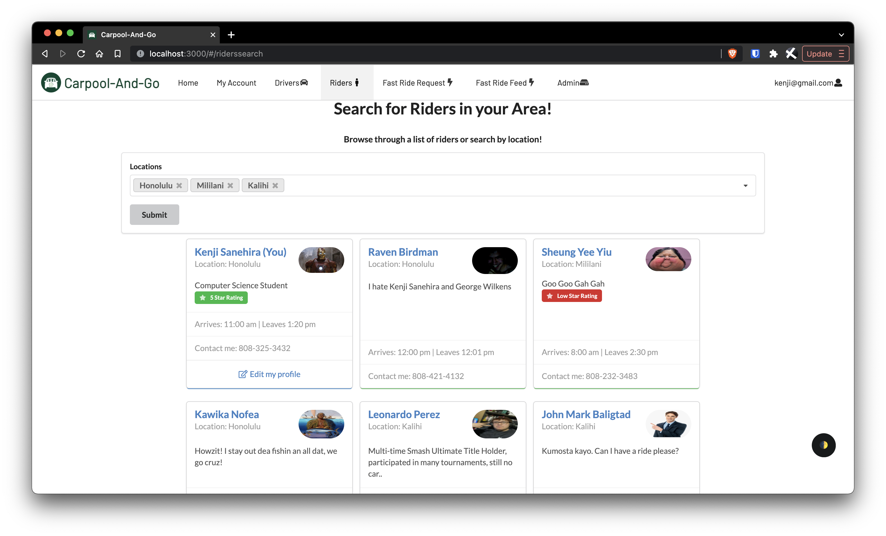
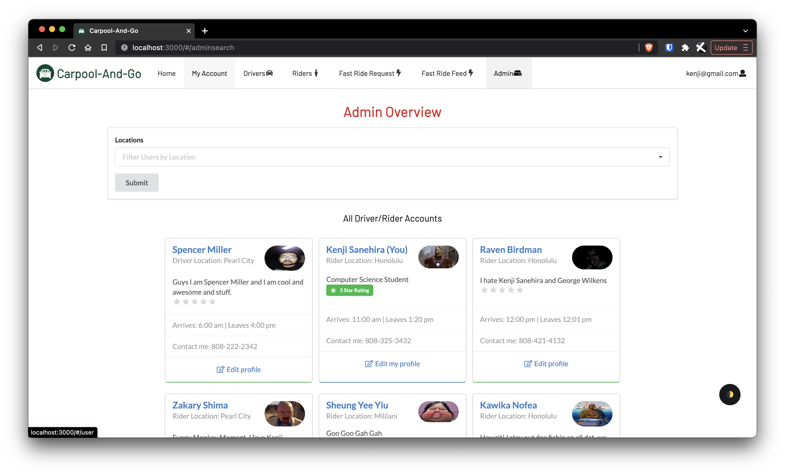

When the discussion of design patterns occurs, it can be easy to overlook what specifically
is a design pattern or what occurs to implement a design pattern. Design patterns help to
generate a structure for projects to effectively grow out and scale from its origin. 
Acting as the “blueprint” to a project's direction, design patterns help to keep uniformity
between commonly used elements in a project while keeping consistency in new changes.

<h3>Apartment Plans?</h3>

A strong example of a design pattern being implemented is when constructing apartment
buildings. If a general contractor is tasked to direct the construction of a new apartment
building, they require the use of blueprints to cover the specifications of how to build
each unit in the building. If the contractor decided to go against this design and freely
design every apartment component from scratch, the project would spiral into a nightmare
with little to no consistency, multiple unique problems with varying solutions, Without
proper direction, any project involving multiple individuals will fall into disarray as a
result of the varying design choices of individuals (and the varying design decisions even
at an individual level). It is for these reasons that design patterns are established.

<h3>In Practice</h3>

In the same way that blueprints of an apartment building specify and implement specific
details to remain constant, design patterns specify a way to maintain code readability and
structure while asserting that new functionality or features are built in a similar
fashion. In our final project for ICS 314, this concept of design patterns is put to the
true test. With the development of our Carpool-And-Go website, work split amongst 6 group
members leads to varying ideas on approaches to implementations. Establishing design
patterns early on for specific components leads to an efficient development process.
Examples include our User Profile View as well as the Profile Viewer for other accounts. As
these two components were introduced at varying times in production, the design patterns we
established kept these two components from having varying functionality. Instead, both
these pages display different information in almost identical ways. Design patterns at
their core are crucial for software development and its ability to scale.
 

