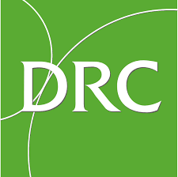

As this semester in Software Engineering draws to a close, a self audit on the skills developed is crucial to contrast the beginning of the semester. I specifically remember my biggest fear stemming from my inexperience in programming quickly. With the introduction of WODs throughout the semester, I quickly adapted to the initial stress of timed programming, and became extremely effective in completing the in-class WODs. Besides this skill, I have sharpened my skills in several areas, as well as developing solid concepts. The largest development in my abilities has been in regards to Agile Project Management. As the last month of software development has focused on a group collaboration effort in developing our Carpool Meteor application, I have received a large exposure to effective software development practices. Although challenging at times, it has given me a clearer view of the differences in commercial software development.

The development of the final project not only gave me a detailed understanding of both frontend and backend development, but served as a platform to showcase my software development skills in order to secure a Summer 2022 Software Internship. This project forced me to immerse myself in implementing design patterns for the application, adherence to the coding standards of eslint, and a deep dive into Meteor’s interaction with subscriptions in order to implement the various filtering, addition, and deletion features of the application. If it wasn’t for the final project, I wouldn’t be able to showcase my software development skills in a group environment.

The use of Design Pattern was something that allowed me to effectively approach the development of similar aspects within the Final Project. As design patterns are sorts of problems in our environment that occur many times, this strategy of development led to quicker turnarounds on completing issues and therefore a more polished final product. In several pages, the user’s account data must be grabbed in order to either display content or to modify the current values. Because our group developed specific ways to accomplish this, code redundancy was reduced, which minimized confusion, points of failure, and allowed us to simplify testing in certain areas.

Moving forward in my pursuit of a degree in computer security science, I have a newfound appreciation and interest in Software Engineering. Through the completion of this course, I have learned how to effectively program in a group environment, adjust to a new technology stack, and utilize development tools effectively to automate testing practices as well as mitigate potential issues through automatic checks, and design patterns. I believe that Software Engineering has been arguably the most impactful Computer Science course I have taken at the University, and I look forward to applying these development skills in a real working environment.

