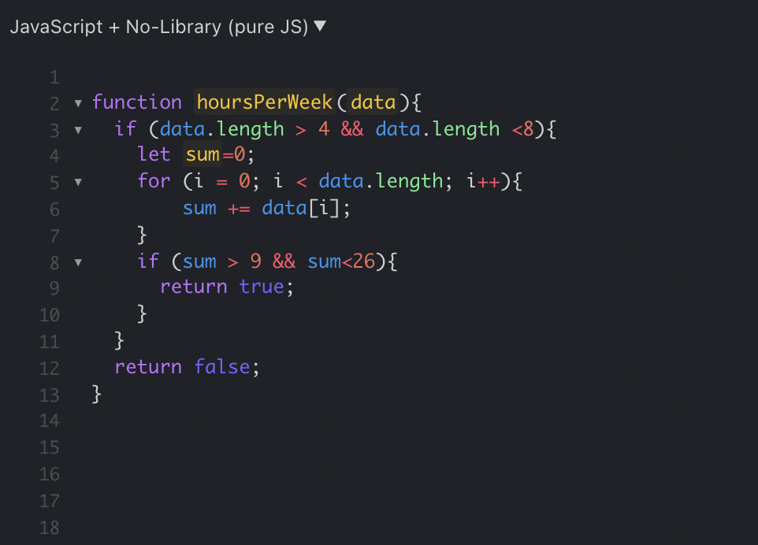

With the first week of my Software Engineering course under my belt, I can say with confidence that my first exposure to Javascript has been interesting. I have found that there is a certain level of control provided by this programming language that other languages don't offer. One of my first takeaways of this was early on into the learning material. Being able to pass functions in as a parameter (first class functions) can simplify coding in a way where most languages refuse to do so. This can allow for smooth delegation of tasks in a function rather than having a function take in multiple parameters for various tasks.  

To add to this overarching concept of expanded control, I never realized how useful an array structure could be when multiple data types can be used within the same array. Being primarily exposed to Java, Python, and most recently C/C++, the concept that all array data must be of the same type has been ingrained with no question as to why this is the case. Learning how arrays don’t truly exist, and the power of pointers in C last semester expanded my perspective on Computer Science, and while this may only be the first week of the course, I can see how this concept can aid in the simplification of problems. While C/C++ may be a faster language in practice, I still believe that Javascript will be a useful tool for software development.  

Focusing on the class specifically, I am not sure if I am a fan of the approach on “athletic software engineering”. Though general praise of the teaching method was presented in the form of former student’s feedback, I believe that it is too early in the semester to know if I will properly adapt to this style of teaching. Previous courses have focused primarily on code quality, efficiency, and readability, not production speed. It does present a new challenge in the form of proof that I can apply concepts in a tense scenario, though I know that I could create cleaner, and more efficient code given more time to do so. The weekly WODs have been manageable at the moment, I have found that the repetition leads to more concise solutions after each iteration. WODs from the Teaching Assistant have also aided in affirming this.  

After coming close to finishing the first Module in Software Engineering, I must say that the initial fears of biting off more than I can chew in a class workload have eased a bit. Establishing communication with my peers in the class has helped me to know that others are in the same boat, especially with the added obscurity of an online course versus an in person class. I am hopeful that at the conclusion of this semester I will have refined my skills to pass the WODs with confidence, and have a deeper appreciation for Software Development. I look forward to what experiences lie ahead of these 16 weeks.  

 

