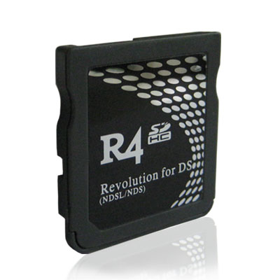

Software engineering is more than just a career path and emerging interest for me, it is an admiration that has stemmed from my childhood years. Growing up in a middle class family during what is arguably the largest financial crisis of the last 50 years meant that money was tight. While many of my peers possessed multiple gaming consoles, home computers, and the occasional iPod, I was fortunate enough to have my very own Nintendo DS console. This pocket handheld is what I hold responsible for the roots of my Computer Science interest.    

While the handheld itself fascinated my childhood imagination, it provided little use without game cartridges. I had a few favorites, though this took months of allowance saving to afford. This however changed in an instant when I got my hands on a 3rd party flash cartridge (R4 Card) while at a swap meet. I can still remember being appalled at the vast game library held within the unusual looking cartridge, a library so vast that I couldn’t comprehend how they could all fit into the space of what was normally a singular game. This cartridge became a bit of an obsession, learning to navigate the various menu settings, showing it off to friends, learning about emulated games, it was my gateway into technology, and the software that powers it.  

As the years have passed, this spark of interest hasn’t faded, it has only grown. Pocket handhelds turned into smartphones, which set in stone my general direction of Computer Science. In middle school I discovered the Jailbreaking scene within iOS and iPhones. This was the first true time I was exposed to how creative, and innovative open source software development could be in a community. Restrictions put in place on a device you own no longer existed, allowing any feature dreamed up to be created by whoever was willing to put in the required time and effort. My support for Open Source Software has continued to grow since this time period.  

In this Software Engineering course (ICS 314), I hope to gain a true understanding of the development process with a team, as well as being exposed to the various tools that aid the development process. While earlier courses in the Computer Science pathway have primarily focused on developing the general thought process of Computer Science, and familiarizing the student in how to translate ideas into code, I hope to see what development is truly like in a more “real world” scenario. I hope to create projects that can help me to expand my portfolio, and to sharpen my efficiency in time sensitive development.  

